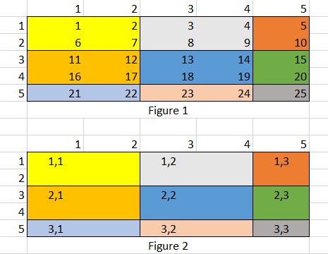
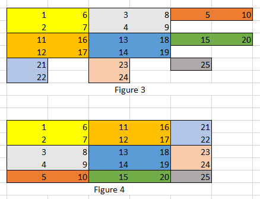
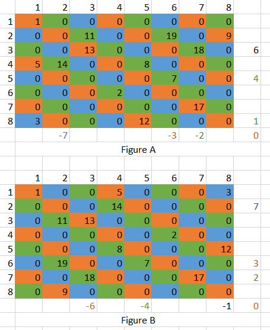

## Non-Sparse Matrix :
### Page Layout
 - In `matrix.h`, we have specified variable M = 32, that is number of rows & colums of submatrix. So, submatrix size in 1 page = 32*32.(By Assuming `int` takes 4 byte, PageSize = 32\*32\*4 bytes = atmost 4KB per page). We can also change it for testing purpose.
 - so, basically we are storing submatrices of original matrix(shown in Figure 2) into different pages(page size<8KB). below is the example containing submatrices of atmost 2\*2 size, original matrix size is 5\*5.
  - For example, Page_1_1 contains:
     - 1 2
     - 6 7
     - 

### Transpose Operation:
 - At first, perform transpose operation on entries of same page.(internally) (given in Figure 3)
   - For example, Before Transpose, Page_1_3's content:
     - 5
     - 10
   - After internal transpose, content will be:
     - 5 10
 - Interchange page names(such that we don't have to copy values from 1 page to another). For example, page_1_2 will be changed to page_2_1 and vice versa. Diagonal matrices will stay as it is. (i.e. page_2_2).
 - Effectively, Matrix will look like Figure 4. 
 - Below is the example of 5\*5 matrix transpose using atmost 2\*2 submatrices.(pages)

## Sparse Matrix:
### Compression Technique:
 - For sparse matrix, We can't store the matrix, submatrix wise. It will consume unneccesary space.
 - so, We have stored non-zero values diagonally into different pages.
 - If there are so many values on single diagonal, then the values will be stored in multiple pages.
 - For example, By default page name will be Page_0_0. if it overflows then new page Page_0_1 will be created.
 - If particular diagonal `don't contain any non-zero value` then it's corresponding `page won't be created`. 
### Page Layout:
 - we are storing 3 values for each non-zero element: (row no., col no, value) inside respected page.
 - Below is the example of 8\*8 matrix containing 14 non-zero elements.(Sparseness > 60%)
 - Diagonal number is given on right-bottom side of matrix.
 - Figure A contains original matrix and B contains it's transpose.
 - For example, Diagonal 1 will be stored in Page_1_0 as follows:
   - 2 3 11 (Where row = 2, col = 3 and value  = 11)
   - 4 5 8
   - 5 6 7

  - 

### Transpose Operation:
 - Swap first 2 values(row and column number) for each cell in each page.
   - For example, Page_1_0's entries will be :
   - 3 2 11
   - 5 4 8
   - 6 5 7
 - Change Page-name. For example, Page_1_0 to Page_-1_0 and vice versa.
   - Example: In Figure A, Non-empty diagonals are -7,-3,-2,0,1,4 and 6.
   - Their name will be switched. New diagonals are -6,-4,-1,0,2,3 and 7. 
 - Principle diagonal page(s) won't require any change. (i.e. Page_0_0).
 
## Compression ratio as a function of the percentage of sparseness of the matrix:
 - Compression depends on # of empty values on each diagonal.
 - If any diagonal don't contain any non-zero value, then page won't be created. Hence, space won't be wasted.
 - In worst case, Internal Fragmentation will occur in each diagonal's last page.
   - For example, we are storing 10 entries in each page and a diagonal contains 55 non-zero entries.      Then, 5 pages will be full. and last page will contain 5 entry. and 5 entry's space will remain      unusable.
   - In worst case, if each diagonal covers one non zero value then there will be at least there will be 2*n - 1 pages. where n = # of rows of matrix.